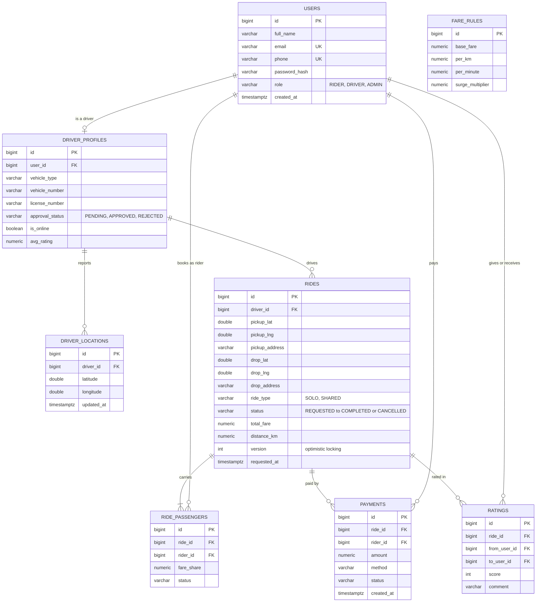

# Station Connect: ER Diagram

GitHub renders the diagram below automatically. Source of truth for the real tables is `database/schema.sql`.

> **Check once:** the `users` columns match `schema.sql`. The other tables follow our plan, so compare them with `schema.sql` and fix any column names that differ.

## Key design decisions

- **One shared ride = one `rides` row plus several `ride_passengers` rows.** A solo ride is a ride with one passenger, so solo and pooled rides use the same tables.
- **Ride status flow:** `REQUESTED` → `ACCEPTED` → `ARRIVED` → `STARTED` → `COMPLETED` (or `CANCELLED`).
- **`rides.version`** is for optimistic locking, so two drivers cannot accept the same ride.
- **`fare_rules`** has no relations. It holds the current pricing settings the admin edits.
- **Not in the schema yet:** `sos_alerts` (SOS feature, planned for Day 17).
